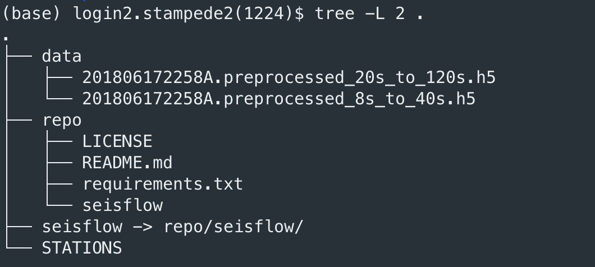
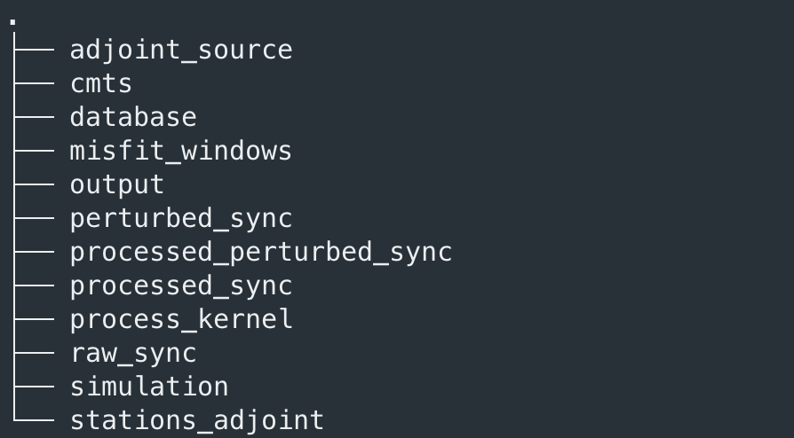

.. _structure_inversion:

Structure inversion on stampede2
==================================================================

Here we use an example to perform the structure inversion on stampede2, the data we are using could be downloaded from `the Google Drive <https://drive.google.com/drive/folders/1qdsAGgrIzXniRc55wP-23Fnd1DWoq7Wf?usp=sharing>`__. All the data
are processed ASDF files. As for how to process the raw ASDF files and the conversion between the ASDF files and the SAC files, you can refer to the
next section.

The workflow of doing the structure inversion is:

1.  Perform the forward simulation to calculate the wave field and the synthetics of the current model.
#.  Based on the current data, calculate the misfit and the corresponding adjoint sources.
#.  Do the kernel simulation using the adjoint sources.
#.  Process the kernel, including summing up, preconditioning, and smoothing.
#.  Calculate the synthetics of the perturbed model using the conjugate gradient method.
#.  Assume the synthetics are in the linear relationship with the amplitude of the model perturbation, approximate the synthetics of different model perturbation, and do the line search to find the optimal step length.
#.  Generate the new model for the next iteration.

Prepare for the inversion
---------------------------------------------
Firstly, we can download the data and the package in the root directory. Additionally, we should also copy the STATIONS file of Specfem.

And then, we should extract the "data info" and build up the "windows".

*   **data info:** the data info is a set of pickle files storing the information of the arrival time of different phases, 
    the great circle distance between the source and the stations, etc.. Since such information is widely used in the 
    inversion, it's better to store them permanently. We can run::

        mkdir -p data_info
        mpirun -np 1 python -m seisflow.scripts.shared.mpi_extract_data_info --asdf_directory data --station_fname STATIONS --output_dir data_info/

    Here we use ``mpirun`` as this program is written in parallel. Since we have only one event here, we might only run ``mpirun -np 1``. If we have 
    more events, we can run it using more processes. (it's also fine if smaller than the number of events.)

    It may take a while (~5 min) to finish as calculating the travel time for lots of stations is time consuming. After finishing calculating, we can check
    the content in the data_info.

    The structure of the data_info directory is:

    .. image:: ../_static/img/tutorial_2.png
        :width: 60%

    For each file, it stores the information of one kind of parameter we are interested in of all the events. In the root directory, we can check the content of one pickle
    file using the IPython console:

    .. image:: ../_static/img/tutorial_3.png
        :width: 60%

    As you can see, for the event **201806172258A** and the station **KG.YKB**, the travel time of P wave is 100.29340264265632 predicted by the 1D model.

    The idea of storing each parameter in a single file is that users can further add more parameters they are interested in and store in other files while not 
    influencing the current data_info files. So it can extend the current seisflow package easily.

*   **build up the windows:** The windows are important as within the windows we calculate the misfit and further the adjoint source. Seisflow has provided a class named
    Window to store the information of a single window and a class named Windows_collection to store a set of Window class. Any new scripts that generate the same classes 
    is able to be incorporated into the whole workflow. Here we use a constant window with the definition the same as `Tao, 2018 <https://agupubs.onlinelibrary.wiley.com/doi/full/10.1029/2018GC007460>`__. 
    We can also write some script to convert the windows from `Flexwin <https://geodynamics.org/cig/software/flexwin/>`__ or `Pyflex <https://krischer.github.io/pyflex/>`__ to our windows pickle files.
    We can run::

        mkdir windows
        python -m seisflow.scripts.shared.mpi_tao_2018_ggg_windows --data_info_directory data_info/ --time_length 1800 --output_dir windows

    It will generate a file named ``201806172258A.pkl`` in the ``windows`` directory. If we have more than one event, each file will generate a single windows file.

    If we look into the windows file:
    
    .. image:: ../_static/img/tutorial_4.png
        :width: 100%

    It represents that for the station ``SN.XAN``, in the category ``t``, we have two windows. In FWI, generally we will consider to divide windows into different categories. And in each category, we have 
    different stations, each station might contain several windows. This structure will help us calculating and applying appropriate weighting scheme. 

Set up the root directory
--------------------------------

Below is an example of a shell file named ``inversion.sh`` placed into the root directory, which is used in my inversion. This shell script is:

.. literalinclude :: ../_static/code/structure_inversion.sh
   :language: bash

The idea here is that we should prepare every files used in the inversion and configure everything, then we simply run ``sh shell.sh``. 
``seisflow.scripts.xsede.xsede_perform_structure_inversion`` will generate 3 slurm job scripts stored in the ``slurm-scripts`` directory. 
(no need to make this directory by ourselves) And it will submit the 3 jobs in order with the dependency. The first job will do the forward 
simulation, calculate the misfits and the adjoint sources, set up the environment for the adjoint simulation and then run the adjoint simulation.
The second job depends on the first job, and it focus on processing the kernel. (summing up, preconditioning, smoothing, etc..) By using the kernel
generated in the second job and generate the perturbed model files, the third job will run the forward simulation of the perturbed model. By comparing
the synthetics from the perturbed model and the initial model, we can do the line search and finally get the optimized model at this iteration.

It's recommended to read the source code to understand the meaning of each flag, but there are something that needs to be care:

* **base_directory:** It should be empty.
* **cmts_directory:** It should store the GCMT solution files with the name as the GCMT id.
* **ref_directory:** It's the reference Specfem3D-globe directory, and should be compiled. All of our simulation directories (for each event) will make soft links to the bin files.
  The ref directory should use the GLL model of the last iteration. (or the initial model) The detail about how to set up the GLL model will be introduced in other sections.
* **last_step_model_update_directory:** Used for the conjugate gradient method, usually the ``inversion/process_kernel/INPUT_GRADIENT/`` directory of the last iteration. At the first iteration, users can cancel the second job, and modify the job script to use the gradient descent method.
  So this directory can be empty then.
* **sem_utils_directory:** We use the smoothing script provided by this package. The `sem_utils <https://github.com/taotaokai/sem_utils>`__ package is designed by Kao Tao for his paper `Tao, 2018 <https://agupubs.onlinelibrary.wiley.com/doi/full/10.1029/2018GC007460>`__.
  This package should be compiled using the ``.h`` files in the **ref_directory:**. (Detail could refer to the sem_utils package)
* **source_mask_directory:** This directory is used for providing external source mask files. The detail will be discussed in other sections.
* **n_each and n_iter:** since doing FWI usually requires lots of computational resources, when we are doing the forward modeling and the adjoint simulation, we usually 
divide the whole simulation into several iterations, and in each iteration, we run several for several events simultaneously. Here **n_each** is the number of events for each 
iteration and **n_iter** is the total number of iterations.

Execute the inversion script
----------------------------------

By executing the shell script, inside the ``inversion`` directory, we will see it will be filled with some generated directories:

In this directory, each sub-directory will store some generated files during the inversion. For example. the ``misfit_windows`` directory will store the misfit information of the initial model, 
and the ``adjoint_source`` directory will store the adjoint sources in the ASDF format. The ``simulation`` directory contains simulation directories for each event and all the kernel processing 
tasks are performed in ``process_kernel``.

After finishing the three jobs, the output model will be placed in ``inversion/process_kernel/OUTPUT_MODEL/``. Usually in the directory, the model file will be named as:
``proc000000_reg1_vsv_new.bin``. However, when we are using the GLL model in Specfem3D-globe, we should use the name as ``proc000000_reg1_vsv.bin``. Seisflow has provide a 
script ``seisflow.scripts.structure_inversion.ln_new_model_to_gll`` to make soft links from files like ``proc000000_reg1_vsv_new.bin`` to ``proc000000_reg1_vsv.bin``.

Now you have the output model and can start to do the next iteration. Usually it's better to hold the third job and check the result of the second job, since in some cases 
the program complains that we should use the gradient descent method at this step since the critical point is met. And for this case, we can modify the slurm script of the second 
job and use the gradient descent method instead.

In stampede2, there are always cases such the job has exceeded the time limit, some nodes are crashed, and lots of annoying problems. So understand every parts of the package and 
Specfem3D-globe is essential to make everything correct.

For other HPC systems, users can consider to modify the function about the slurm job submission, which should be the most different part across HPC systems.